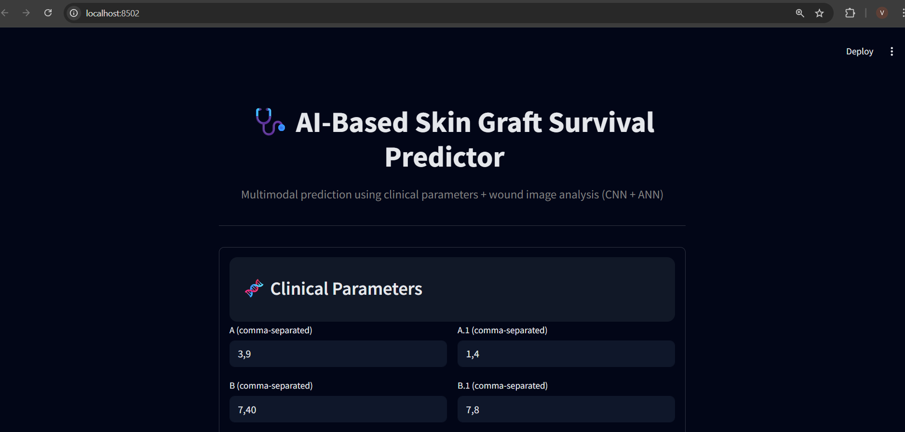
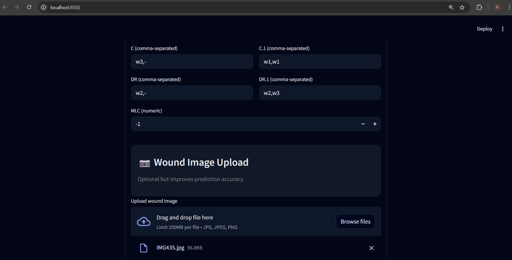
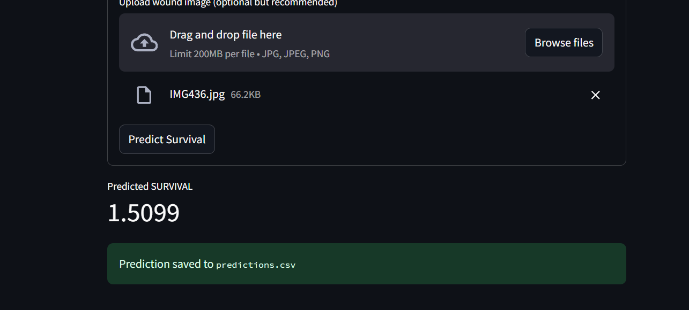

# 🩺 AI-Based Skin Graft Survival Prediction using CNN + ANN

<p align="center">


</p>

---

## 📌 Overview

Skin grafting is a common surgical procedure used to treat burns, trauma, chronic wounds, and other skin defects. Predicting whether a graft will survive is a challenging clinical task.

This project presents a **hybrid deep learning model** that combines:

- 🧠 **Artificial Neural Network (ANN)** for clinical patient parameters
- 📷 **Convolutional Neural Network (CNN)** for wound image analysis

The hybrid model uses both sources of information to estimate a **Skin Graft Survival Score**, providing an AI-assisted decision support system.

---

## ✨ Features

- 🩺 Predict skin graft survival score
- 📷 Upload wound images for CNN-based feature extraction
- 🧠 Hybrid CNN + ANN architecture
- 📊 Clinical data preprocessing and prediction
- 🌐 Interactive Streamlit web application
- 💾 Prediction logging to CSV
- 📈 User-friendly visualization of prediction results

---

# 🧠 Model Architecture

```
             Clinical Parameters
                     │
                     ▼
          Data Preprocessing
                     │
                     ▼
              ANN Feature Vector
                     │
                     │
Wound Image ──► CNN Feature Extraction
                     │
                     ▼
         Feature Fusion (Hybrid Model)
                     │
                     ▼
       Skin Graft Survival Prediction
```

---

# 🛠️ Tech Stack

| Category | Technology |
|----------|------------|
| Programming Language | Python |
| Deep Learning | TensorFlow, Keras |
| Machine Learning | Scikit-learn |
| Data Processing | Pandas, NumPy |
| Visualization | Matplotlib |
| Deployment | Streamlit |
| Model Serialization | Joblib |

---

# 📂 Project Structure

```text
Skin-Graft-Survival-Prediction/
│
├── src/
│   ├── app.py
│   ├── predict.py
│   ├── cnn_feature_extractor.py
│   ├── cnn_train.py
│   ├── prepare_cnn_dataset.py
│   └── batch_predict.py
│
├── models/
│   ├── best_model.h5
│   ├── encoder.joblib
│   └── template_df.pkl
│
├── Data/
│
├── assets/
│   └── screenshots/
│
├── docs/
│
├── requirements.txt
├── README.md
└── .gitignore
```

---

# 📷 Application Screenshots

## 🏠 Home Page



---

## 📋 Patient Information Form



---

## 📈 Prediction Result



> Replace the image names above with your actual screenshot filenames.

---

# ⚙️ Installation

Clone the repository

```bash
git clone https://github.com/Vanshika300/Skin-Graft-Survival-Prediction.git
```

Move into the project directory

```bash
cd Skin-Graft-Survival-Prediction
```

Install dependencies

```bash
pip install -r requirements.txt
```

Run the application

```bash
streamlit run src/app.py
```

---

# 📊 Dataset

The project combines two different sources of information:

### Clinical Data

- Patient parameters
- MLC values
- Survival outcome

Preprocessing includes:

- Feature splitting
- One-hot encoding
- Normalization

### Image Data

- Wound photographs
- CNN-based feature extraction
- Image embeddings fused with ANN inputs

---

# 🎯 Future Improvements

- 🔬 Multi-class wound classification
- 🩹 Healthy skin comparison
- 📈 Explainable AI (Grad-CAM)
- ☁️ Cloud deployment
- 📱 Mobile application
- 🏥 Hospital dashboard integration

---

# 📌 Sample Output

```text
Predicted Graft Survival Score

11.84

Prediction Status

✅ Higher Relative Graft Survival
```

---

# 👩‍💻 Authors

### Vanshika Shukla

Computer Science & Engineering (AI & ML)

GitHub:
https://github.com/Vanshika300

---

# 🙏 Acknowledgements

- TensorFlow
- Keras
- Scikit-learn
- Streamlit
- Open Source Community

---

# ⭐ Support

If you found this project useful, consider giving it a ⭐ on GitHub.

It helps support our work and encourages future improvements.
